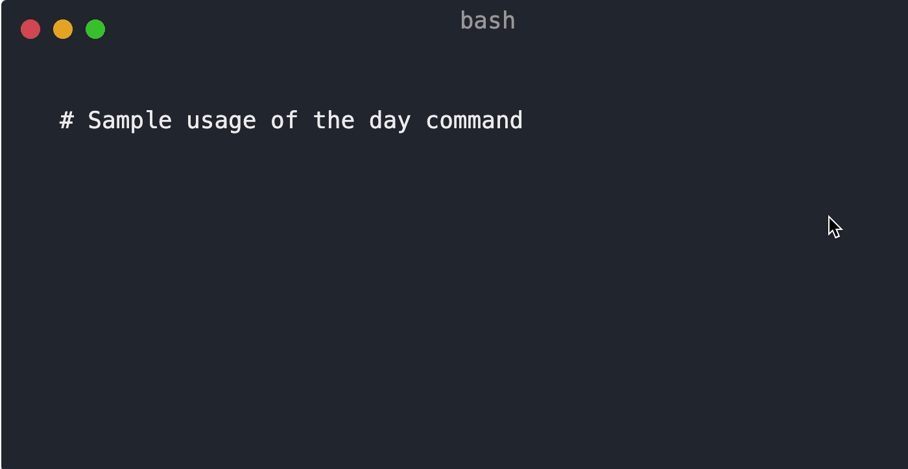

# Calendar 📅


As a developer, have you ever wanted to look up what day of the week a particular day falls on or find
the duration between two dates right from your terminal? Well, wait no more because this CLI utility
provides you with just that!

Right now, the project's still a WIP, but I hope to add these two features soon.

## Setup

1. Fork this repository and clone it.

2. Install Python 3.8+ from the [official website](https://www.python.org/downloads/)

3. Install [Poetry](https://python-poetry.org/docs/):

-  MacOS / Linux / Bash on Windows:
    ```bash
    curl -sSL https://raw.githubusercontent.com/python-poetry/poetry/master/get-poetry.py | python -
    ```

-  Powershell:
    ```powershell
    (Invoke-WebRequest -Uri https://raw.githubusercontent.com/python-poetry/poetry/master/get-poetry.py -UseBasicParsing).Content | python -
    ```

4. [Configure Poetry](https://python-poetry.org/docs/configuration/) to allow creation of a Python virtual environment within the project root:
```bash
poetry config virtualenvs.in-project true
```

5. Install the required dependencies through Poetry:
```bash
poetry install
```

6. Activate the virtual environment through the `activate` command:

- MacOS/Linux:
```bash
source .venv/bin/activate
```

- Powershell:
```powershell
.venv\Scripts\Activate.ps1
```

> NOTE: To find out more about Python virtual environment, you can refer to the [`venv` documentation](https://docs.python.org/3/library/venv.html)

7. Execute the `main.py` Python script to see all the CLI options:
```bash
python main.py
```

## Commands



## Credits
1.  This CLI utility has been bootstrapped with [@tiangolo's  Typer](https://github.com/tiangolo/typer)
2.  Emojis from [emojis.wiki](https://emojis.wiki/monday/)
